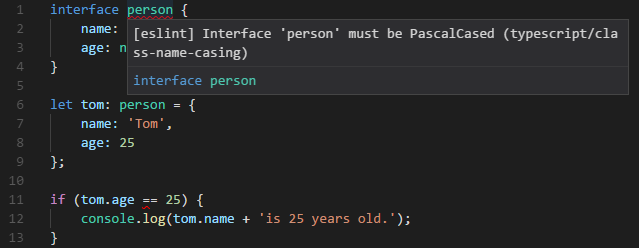

TypeScript 的代码检查应当使用 ESLint + `typescript-eslint-parser`。

## 什么是代码检查

代码检查主要是用来发现代码错误、统一代码风格。

在 JavaScript 项目中，我们一般使用 ESLint 来进行代码检查。它通过插件化的特性极大的丰富了适用范围，搭配 `typescript-eslint-parser` 之后，甚至可以用来检查 TypeScript 代码。

## 为什么需要代码检查

有人会觉得，JavaScript 非常灵活，所以需要代码检查。而 TypeScript 已经能够在编译阶段检查出很多问题了，为什么还需要代码检查呢?

因为 TypeScript 关注的重心是类型的匹配，而不是代码风格。当团队的人员越来越多时，同样的逻辑不同的人写出来可能会有很大的区别:

- 缩进应该是四个空格还是两个空格?
- 是否应该禁用 `var`?
- 接口名是否应该以 `I` 开头?
- 是否应该强制使用 `===` 而不是 `==`?

这些问题 TypeScript 不会关注，但是却影响到多人协作开发时的效率、代码的可理解性以及可维护性。

下面来看一个具体的例子:

```ts
let myName = "Tom";

console.log(`My name is ${myNane}`);
console.log(`My name is ${myName.toStrng()}`);
console.log(`My name is ${myName}`);

// tsc 报错信息:
//
// index.ts(3,27): error TS2552: Cannot find name 'myNane'. Did you mean 'myName'?
// index.ts(4,34): error TS2551: Property 'toStrng' does not exist on type 'string'. Did you mean 'toString'?
//
//
//
// eslint 报错信息:
//
// /path/to/index.ts
//   3:27  error  'myNane' is not defined         no-undef
//   5:38  error  Missing semicolon               semi
//
// ✖ 2 problems (2 errors, 0 warnings)
//   1 errors, 0 warnings potentially fixable with the `--fix` option.
```

| 存在的问题                      | `tsc` 是否报错 | `eslint` 是否报错 |
| ------------------------------- | -------------- | ----------------- |
| `myName` 被误写成了 `myNane`    | ✅             | ✅                |
| `toString` 被误写成了 `toStrng` | ✅️            | ❌                |
| 少了一个分号                    | ❌             | ✅                |

上例中，由于 `eslint` 无法识别 `myName` 存在哪些方法，所以对于拼写错误的 `toString` 没有检查出来。

而代码风格的错误不影响编译，故少了一个分号的错误 `tsc` 没有检查出来。

对于未定义的变量 `myNane`，`tsc` 可以检测出来。`eslint` 需要能够独立于某个编译环境运行，所以能检测出此类错误，而对于 TypeScript 代码，这其实是一种冗余的检测了。

虽然发现代码错误比统一的代码风格更重要，但是当一个项目越来越庞大，开发人员也越来越多的时候，代码风格的约束还是必不可少的。

## 在 TypeScript 中使用 ESLint

### 安装 ESLint

ESLint 可以安装在当前项目中或全局环境下，因为代码检查是项目的重要组成部分，所以我们一般会将它安装在当前项目中。可以运行下面的脚本来安装:

```bash
npm install eslint --save-dev
```

由于 ESLint 默认使用 [Espree](https://github.com/eslint/espree) 进行语法解析，无法识别 TypeScript 的一些语法，故我们需要安装 `typescript-eslint-parser`，替代掉默认的解析器，别忘了同时安装 `typescript`:

```bash
npm install typescript typescript-eslint-parser --save-dev
```

由于 `typescript-eslint-parser` 对一部分 ESLint 规则支持性不好，故我们需要安装 `eslint-plugin-typescript`，弥补一些支持性不好的规则。

```bash
npm install eslint-plugin-typescript --save-dev
```

### 创建配置文件

ESLint 需要一个配置文件来决定对哪些规则进行检查，配置文件的名称一般是 `.eslintrc.js` 或 `.eslintrc.json`。

当运行 ESLint 的时候检查一个文件的时候，它会首先尝试读取该文件的目录下的配置文件，然后再一级一级往上查找，将所找到的配置合并起来，作为当前被检查文件的配置。

我们在项目的根目录下创建一个 `.eslintrc.js`，内容如下:

```js
module.exports = {
  parser: "typescript-eslint-parser",
  plugins: ["typescript"],
  rules: {
    // @fixable 必须使用 === 或 !==，禁止使用 == 或 !=，与 null 比较时除外
    eqeqeq: [
      "error",
      "always",
      {
        null: "ignore",
      },
    ],
    // 类和接口的命名必须遵守帕斯卡命名法，比如 PersianCat
    "typescript/class-name-casing": "error",
  },
};
```

以上配置中，我们指定了两个规则，其中 `eqeqeq` 是 ESLint 原生的规则(它要求必须使用 `===` 或 `!==`，禁止使用 `==` 或 `!=`，与 `null` 比较时除外)，`typescript/class-name-casing` 是 `eslint-plugin-typescript` 为 ESLint 增加的规则(它要求类和接口的命名必须遵守帕斯卡命名法，比如 `PersianCat`)。

规则的取值一般是一个数组(上例中的 `eqeqeq`)，其中第一项是 `off`、`warn` 或 `error` 中的一个，表示关闭、警告和报错。后面的项都是该规则的其他配置。

如果没有其他配置的话，则可以将规则的取值简写为数组中的第一项(上例中的 `typescript/class-name-casing`)。

关闭、警告和报错的含义如下:

- 关闭: 禁用此规则
- 警告: 代码检查时输出错误信息，但是不会影响到 exit code
- 报错: 发现错误时，不仅会输出错误信息，而且 exit code 将被设为 1(一般 exit code 不为 0 则表示执行出现错误)

### 检查一个 ts 文件

创建了配置文件之后，我们来创建一个 ts 文件看看是否能用 ESLint 去检查它了。

创建一个新文件 `index.ts`，将以下内容复制进去:

```ts
interface person {
  name: string;
  age: number;
}

let tom: person = {
  name: "Tom",
  age: 25,
};

if (tom.age == 25) {
  console.log(tom.name + "is 25 years old.");
}
```

然后执行以下命令:

```bash
./node_modules/.bin/eslint index.ts
```

则会得到如下报错信息:

```bash
/path/to/index.ts
   1:11  error  Interface 'person' must be PascalCased  typescript/class-name-casing
  11:13  error  Expected '===' and instead saw '=='     eqeqeq

✖ 2 problems (2 errors, 0 warnings)
```

上面的结果显示，刚刚配置的两个规则都生效了: 接口 `person` 必须写成帕斯卡命名规范，`==` 必须写成 `===`。

需要注意的是，我们使用的是 `./node_modules/.bin/eslint`，而不是全局的 `eslint` 脚本，这是因为代码检查是项目的重要组成部分，所以我们一般会将它安装在当前项目中。

可是每次执行这么长一段脚本颇有不便，我们可以通过在 `package.json` 中添加一个 `script` 来创建一个 npm script 来简化这个步骤:

```json
{
  "scripts": {
    "eslint": "eslint index.ts"
  }
}
```

这时只需执行 `npm run eslint` 即可。

### 检查整个项目的 ts 文件

我们的项目源文件一般是放在 `src` 目录下，所以需要将 `package.json` 中的 `eslint` 脚本改为对一个目录进行检查。由于 `eslint` 默认不会检查 `.ts` 后缀的文件，所以需要加上参数 `--ext .ts`:

```json
{
  "scripts": {
    "eslint": "eslint src --ext .ts"
  }
}
```

此时执行 `npm run eslint` 即会检查 `src` 目录下的所有 `.ts` 后缀的文件。

### 在 VS Code 中集成 ESLint 检查

在编辑器中集成 ESLint 检查，可以在开发过程中就发现错误，极大的增加了开发效率。

要在 VS Code 中集成 ESLint 检查，我们需要先安装 ESLint 插件，点击「扩展」按钮，搜索 ESLint，然后安装即可。

VS Code 中的 ESLint 插件默认是不会检查 `.ts` 后缀的，需要在「文件 => 首选项 => 设置」中，添加以下配置:

```json
{
  "eslint.validate": ["javascript", "javascriptreact", "typescript"]
}
```

这时再打开一个 `.ts` 文件，将鼠标移到红色提示处，即可看到这样的报错信息了:



### 使用 AlloyTeam 的 ESLint 配置

ESLint 原生的规则和 `eslint-plugin-typescript` 的规则太多了，而且原生的规则有一些在 TypeScript 中支持的不好，需要禁用掉。

这里我推荐使用 [AlloyTeam ESLint 规则中的 TypeScript 版本](https://github.com/AlloyTeam/eslint-config-alloy#typescript)，它已经为我们提供了一套完善的配置规则。

安装:

```bash
npm install --save-dev eslint typescript typescript-eslint-parser eslint-plugin-typescript eslint-config-alloy
```

在您的项目根目录下创建 `.eslintrc.js`，并将以下内容复制到文件中:

```js
module.exports = {
  extends: ["eslint-config-alloy/typescript"],
  globals: {
    // 这里填入您的项目需要的全局变量
    // 这里值为 false 表示这个全局变量不允许被重新赋值，比如:
    //
    // jQuery: false,
    // $: false
  },
  rules: {
    // 这里填入您的项目需要的个性化配置，比如:
    //
    // // @fixable 一个缩进必须用两个空格替代
    // 'indent': [
    //     'error',
    //     2,
    //     {
    //         SwitchCase: 1,
    //         flatTernaryExpressions: true
    //     }
    // ]
  },
};
```

### 使用 ESLint 检查 tsx 文件

如果需要同时支持对 tsx 文件的检查，则需要对以上步骤做一些调整:

#### 安装 `eslint-plugin-react`

```bash
npm install --save-dev eslint-plugin-react
```

#### package.json 中的 `scripts.eslint` 添加 `.tsx` 后缀

```json
{
  "scripts": {
    "eslint": "eslint src --ext .ts,.tsx"
  }
}
```

#### VS Code 的配置中新增 typescriptreact 检查

```json
{
  "eslint.validate": [
    "javascript",
    "javascriptreact",
    "typescript",
    "typescriptreact"
  ]
}
```

#### 使用 AlloyTeam ESLint 规则中的 TypeScript React 版本

[AlloyTeam ESLint 规则中的 TypeScript React 版本](https://github.com/AlloyTeam/eslint-config-alloy#typescript-react)

## Troubleshootings

### Cannot find module typescript-eslint-parser

您运行的是全局的 eslint，需要改为运行 `./node_modules/.bin/eslint`。

### cannot read property type of null

需要关闭 `eslint-plugin-react` 中的规则 `react/jsx-indent`。

如果仍然报错，多半是因为某些规则需要被关闭，可以使用「二分排错法」检查是哪个规则造成了错误。也欢迎[给 eslint-config-alloy 提 issue](https://github.com/AlloyTeam/eslint-config-alloy/issues/new)。

### VS Code 没有显示出 ESLint 的报错

1. 检查「文件 => 首选项 => 设置」中有没有配置正确
1. 检查必要的 npm 包有没有安装
1. 检查 `.eslintrc.js` 有没有配置
1. 检查文件是不是在 `.eslintignore` 中

如果以上步骤都不奏效，则可以在「文件 => 首选项 => 设置」中配置 `"eslint.trace.server": "messages"`，按 `Ctrl`+`Shift`+`U` 打开输出面板，然后选择 ESLint 输出，查看具体错误。


### 为什么 ESLint 无法检查出使用了未定义的变量(`no-undef` 规则为什么被关闭了)

因为 `typescript-eslint-parser` [无法支持 `no-undef` 规则](https://github.com/eslint/typescript-eslint-parser/issues/416)。它针对正确的接口定义会报错。

所以我们一般会关闭 `no-undef` 规则。

### 为什么有些定义了的变量(比如使用 `enum` 定义的变量)未使用，ESLint 却没有报错

因为无法支持这种变量定义的检查。建议在 `tsconfig.json` 中添加以下配置，使 `tsc` 编译过程能够检查出定义了未使用的变量:

```json
{
  "compilerOptions": {
    "noUnusedLocals": true,
    "noUnusedParameters": true
  }
}
```

### 启用了 noUnusedParameters 之后，只使用了第二个参数，但是又必须传入第一个参数，这就会报错了

第一个参数以下划线开头即可，参考 <https://github.com/Microsoft/TypeScript/issues/9458>
